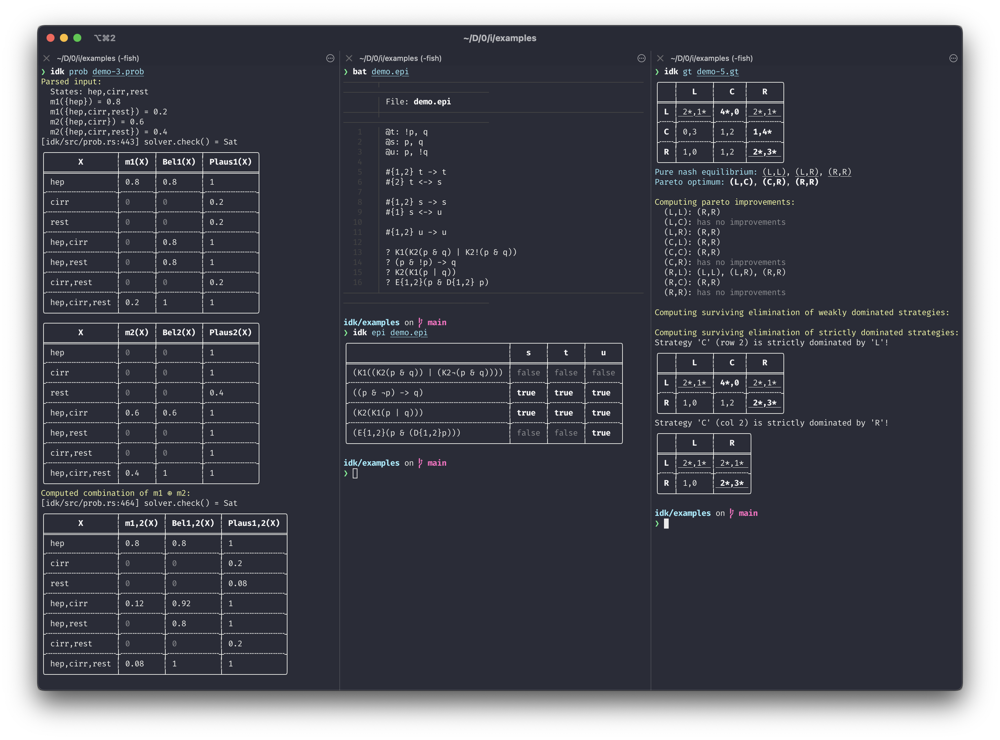

# IDK

> Integrated discrete knowledge-toolkit. A CLI for computing various facts about knowledge, game theory, and probability measures.



## Building

```bash
cargo build
```

## Running

```bash
cargo run help
cargo run gt examples/demo.gt
cargo run epi examples/demo.epi
cargo run prob examples/demo.prob
```
